# Conformal prediction: A unified review of theory and new challenges

- [Conformal prediction: A unified review of theory and new challenges](#conformal-prediction-a-unified-review-of-theory-and-new-challenges)
  - [key feature](#key-feature)
  - [2.1foundations of CP](#21foundations-of-cp)
    - [assumption](#assumption)
    - [bag \& nonconformity](#bag--nonconformity)
    - [Conformal prediction](#conformal-prediction)
    - [validity and efficiency](#validity-and-efficiency)
  - [2.2 objects and labels](#22-objects-and-labels)
  - [2.3 online framework](#23-online-framework)
  - [3.1 Different notions of validity](#31-different-notions-of-validity)
  - [3.2Inductive prediction](#32inductive-prediction)
  - [3.3 Other interesting developments](#33-other-interesting-developments)
    - [Normalized nonconformity scores](#normalized-nonconformity-scores)
    - [Functional prediction bands](#functional-prediction-bands)

## key feature
distribution-free, non-parametric, finite sample, iid

## 2.1foundations of CP
sample z₁, z₂, z₃, ⋯ ∈ Z
train set has n sample 
${(z_1,\ldots,z_{n+1}) \mid z_{n+1} \in \gamma(z_1,\ldots,z_n)}$ are measurable in $\mathbf{Z}^{n+1}$
confidence predictor: $(\gamma^{\alpha})$, $\alpha$ is significance level

### assumption
iid & exchange ability on sample

### bag & nonconformity
$B = \{\!\!\{z_1,..., z_n\}\!\!\}$ :ignore the order of the sample and enable repeated element.
a nonconformity measure (NCM): the difference between z and B;method(A): new example to sample mean or centroid
nonconformity score R=A(B,z)

### Conformal prediction
for new example z:
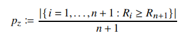
where
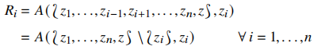

if $p_{z}$ have small value, which mean $R_{n+1}$ and ${z}$ is nonconformity relatively. Otherwise ${z}$ is conformity and include it in the prediction set.
prediction set 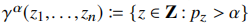

### validity and efficiency
validity: the probability of $z_{n+1}$ not bigger than $\alpha$, then $\gamma$ is valid.
**proposition2.1**:
since the exchange ability, for any $\alpha$ and $\gamma$, the probability would not exceed  $\alpha$(strict validity)
smoothed conformal predictor:
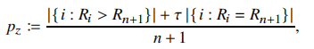
where $\tau \sim U(0,1)$
which ensure the strict validity.
**efficieny**: in classification:small set; in regression: short  interval.

## 2.2 objects and labels
X is object space, Y is label space,Z=X*Y is sample space.
To predict label $y_{n+1}$:
1.choose A to compute $R_i$
2.compute $p_{z_{n+1}}$ 
3.define prediction set 

in classification:
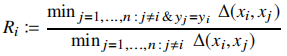
where Δ is a metric on X(usually L2 distance)

in regression:
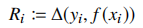
where f is the prediction rule($\hat{y}$)
ridge regression confidence machine:
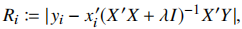
nonconformity scores vector:
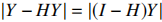
disperse Y into ($y_1$,...,$y_n$,0) and  (0,...,0,$y_{n+1}$), thus can compute of $R_i(y)$-$R_{n+1}(y)$ to find the interval of $p_z(y) > \alpha$ 
RRCM use $z_i$ to compute $R_i$

## 2.3 online framework
online learning still valid since successive errors probabilistically independent:
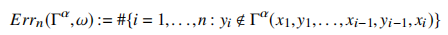
where $\omega$ is the sample sequence
individual:
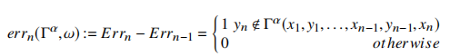
infinite:
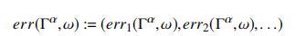

**proposition2.2**:
under the exchange assumption:
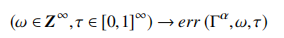
$\sim \mathcal{B}_{\infty}(\alpha)$

## 3.1 Different notions of validity
marginal coverage:
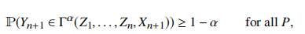
conditional coverage(real):

where $\Gamma^{\alpha}(x) \equiv \Gamma^{\alpha}(Z_1,\ldots,Z_n,x)$  is impossible to get on finite set

local validity(between marginal and conditional validity):
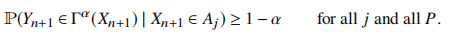
where $A_j$ is partition of A on supp($P_x$) 
advantage: finite sample coverage(both marginal&conditional), asymptotic conditional coverage and asymptotic
efficient

**Conformalised Quantile Regression**:
adapt to any heteroschedasticity of the data and with increased efficiency
1.split data to training and calibration set
2.use quantile regression method A, get
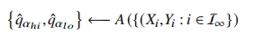
3.compute non-conformity scores:
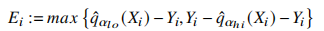
4.prediction interval:
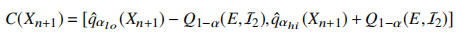
where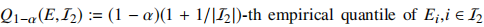

**Mondrian conformal predictors**:
idea:By partitioning samples into several categories,  achieve stronger validity
1.Mondrian taxonomy:
measurable function $k$ map sample z to categories k
1.2. n-taxonomy:
$K: \mathbf{Z}^n \to \mathbf{K}^n$
should satisfy permutation equivariance:
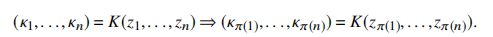
2.compute p-values:
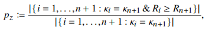
where $k_{n+1}$=k(z)

**proposition3.1**:
if sample come from exchange distribution, MCP based on Mondrian taxonomy is category-wise exact.

## 3.2Inductive prediction
**inductive conformal predictors (ICPs)**:
1. `Training Data` → `General Rule` (inductive step)  
2. `General Rule` → `New Object Prediction` (deductive step)
   
approach:
1.split data into training 1~m and calibration set m+1~n
2.compute the nonconformity scores:
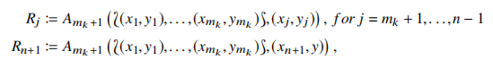
3.compute p_values:
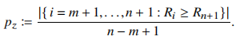
advantage: computation efficiency and flexible
the size of calibration set should be >300 and <30%

N several splits(like k_fold):
using a Bonferroni-type argument — built at level 1 − α/N
disadvantage: longer interval

**jackknife**:
1.train f(-i) for any i
2.compute $R_i$
advantage: shorter interval than ICPs one split

## 3.3 Other interesting developments
**Venn predictors**：
1.can predict the distribution of $p_{n+1}$
2.adapt to continue label
3.higher computation efficiency

### Normalized nonconformity scores
data with heteroskedasticity
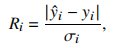
confidence predictor:
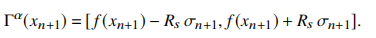
advantage:tighter predictive region
estimate error:
1.$\sigma_i = g(x_i) + \beta$
where $\beta$ is a sensitivity parameter that regulates the impact of normalization,g is a different model,may like $cf$
2.k-NNR
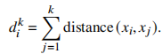
the shorter the distance, the better the prediction

### Functional prediction bands
validity: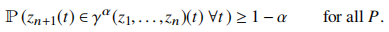
where t may like sample feature x, but continue
1.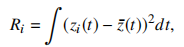
where $\bar{z}(t)$ is the average on augmented set
2.prediction band:
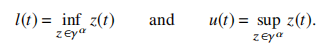
satisfy 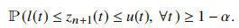
2.1 sometimes is hard to compute these,revised form:
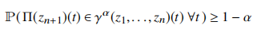
where $ \Pi $ is a mapping into a finite dimension function space
to simplified computation,try to project feature
1.choose a basis of functions(like fourier)
2.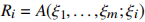
where $\xi_i$ is a projection coefficients
3.construct accept region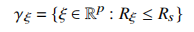
4.predictor: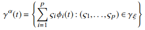
